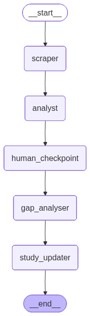

# Ladder — Generating personal learning plans for your dream jobs

Ladder is a multi-agent pipeline that automates your job search and turns it into a personalised learning plan.

It searches for roles matching your criteria, scores and ranks them against your profile, identifies skill gaps by comparing job requirements to your CV, and generates a targeted study plan to close those gaps.

Built using the raw Anthropic API (no frameworks) to demonstrate core agent fundamentals: ReAct loops, tool use, structured outputs, human-in-the-loop checkpoints, and multi-agent chaining.

## Pipeline



---

## Phase 3 — Autonomous Anomaly Alerting Service

A production-deployed LangGraph agent that monitors property transaction data, detects price anomalies using z-score analysis, and fires structured alerts to AWS CloudWatch. Deployed on AWS Lambda via CDK with an EventBridge schedule.

### Architecture

```
EventBridge (hourly trigger)
        ↓
AWS Lambda — LangGraph Agent
  ├── tool: load_transactions(client_id, date)  ← reads from S3 (per-client isolation)
  ├── tool: detect_anomalies()                  ← z-score analysis (PhD edge)
  └── tool: fire_alert()                        ← structured JSON → CloudWatch Logs
        ↓
CloudWatch Logs  →  ANOMALY_DETECTED alerts
CloudWatch Metrics  →  AnomalyAlertingService/AnomalyCount
```

### Key features

- **Deployed on AWS Lambda** — serverless, no server to manage
- **Scheduled via EventBridge** — runs every hour automatically
- **Per-client data isolation** — each client's data lives under `s3://{bucket}/{client_id}/transactions/`
- **CloudWatch Logs** — every anomaly fires a structured JSON alert
- **CloudWatch custom metrics** — `AnomalyCount` tracked per run, graphable on a dashboard
- **Infrastructure as code** — fully defined in AWS CDK (`infra/`), reproducible with one command

### Folder structure

```
├── src/
│   ├── handler.py           # Lambda entry point
│   ├── agent.py             # LangGraph anomaly detection agent
│   └── tools/
│       └── anomaly_tools.py # load_transactions, detect_anomalies, fire_alert, push_metric
├── infra/
│   ├── app.py               # CDK entry point
│   └── stacks/
│       └── anomaly_stack.py # Lambda + S3 + EventBridge + IAM defined here
└── layer/
    └── python/              # Lambda layer — pre-built dependencies
```

### Deploy

```bash
# Install CDK CLI (one-time)
npm install -g aws-cdk

# Set up Python environment
python -m venv .venv && source .venv/bin/activate
pip install aws-cdk-lib constructs

# Build the Lambda layer
pip install langgraph anthropic langsmith langchain-anthropic numpy boto3 pydantic pydantic-core \
  -t layer/python/ \
  --platform manylinux2014_x86_64 \
  --implementation cp \
  --python-version 3.12 \
  --only-binary=:all:

# Export API keys
export ANTHROPIC_API_KEY=your_key

# Deploy to AWS
cd infra && cdk deploy
```

### Invoke manually

```bash
aws lambda invoke \
  --function-name YOUR_FUNCTION_NAME \
  --payload '{"client_id": "demo", "date": "2026-01-20"}' \
  --cli-binary-format raw-in-base64-out \
  --region eu-west-1 \
  output.json && cat output.json
```

### Tear down

```bash
cd infra && cdk destroy
```